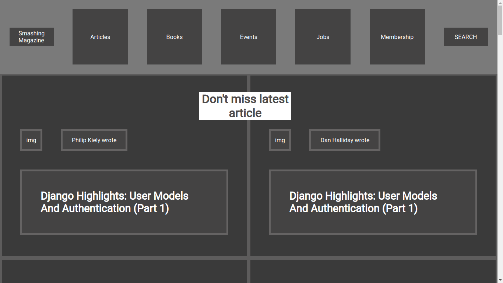

# Project:- Smashing magazine 

> This project consists of building a heatmap of the Smashing magazine website

A grayscale heat map of the website that indicates which elements have the greatest weight in the visual hierarchy.

## Built With

- HTML and CSS,
- Grid and Flex,
- UI and UX

## Live Demo

[Live Demo Link](https://rawcdn.githack.com/ioilmio/smashing-magazine-project/913207926e3532d74ee3ec40ada8de191663cfcd/index.html)

## Getting Started

**This is an example of how you may give instructions on setting up your project locally.**
**Modify this file to match your project, remove sections that don't apply. For example: delete the testing section if the currect project doesn't require testing.**

## Authors

👤 **Hemant soni**

- Github: [@hemant-soni-vst-au4](https://github.com/hemant-soni-vst-au4)
- Twitter: [@Hemants63203059](https://twitter.com/Hemants63203059)
- Linkedin: [linkedin](https://www.linkedin.com/in/hemant-soni-97427b193/)

👤 **Illuminato Salvatore**

- Github: [@ioilmio](https://github.com/ioilmio)
- Twitter: [@ioilmio](https://twitter.com/ioilmio)
- Linkedin: [linkedin](https://linkedin.com/linkedinhandle)

## 🤝 Contributing

Contributions, issues and feature requests are welcome!

Feel free to check the [issues page](https://github.com/ioilmio/smashing-magazine-project/issues).

## Show your support

Give a ⭐️ if you like this project!

## Acknowledgments

- Hat tip to anyone whose code was used
- Inspiration
- etc

## 📝 License

This project is [MIT](lic.url) licensed.
